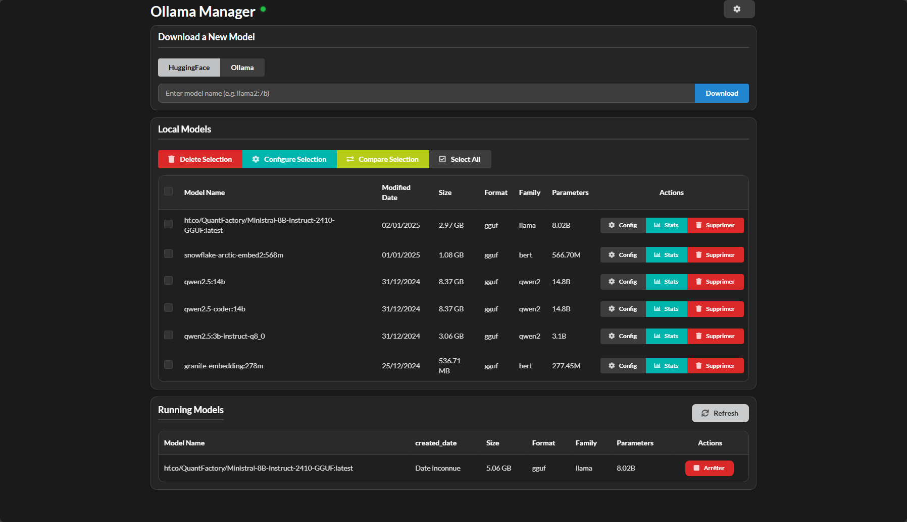

# Ollama Manager UI



## Description
A web interface to manage your Ollama models, built with Flask and Semantic UI.

Multilingual support made possible with Babel. Feel free to contribute your own language translations!

## Features
- Model management (search, download, delete, configure)
- Dark/Light mode (To improve)
- Responsive interface 
- Model usage statistics (Not yet)
- Model configuration  (In progress, not working yet for Huggingface's models)
- Model comparison (In progress)
- Search and pull models directly from HuggingFace or Ollama.com
- English and French languages

## Usage
- Access the web interface through your browser
- Use the theme button at the top left to switch between light and dark modes
- Manage your models through the intuitive interface
- View usage statistics
- Configure models individually or in batches

## Requirements
- Python 3.8+
- Ollama installed and running
- Docker (recommended) OR pip/another Python package manager

## Installation
1. Clone the repository:
```bash
git clone https://github.com/BornSupercharged/OllamaManagerUI.git
cd OllamaManagerUI
```

2. Configuration:
- Copy the example.env file over to ".env" and update as needed:
```bash
OLLAMA_SERVER_URL=http://localhost:11434 # change if you run locally on a different port
FLASK_SECRET_KEY=dev_key_123 # you can change this to something Super Secret
BABEL_DEFAULT_LOCALE=en # currently en and fr
```

## Running Ollama Manager UI
### Using Docker
1. Clone the repository:
```bash
git clone https://github.com/BornSupercharged/OllamaManagerUI.git
cd OllamaManagerUI
```

2. Update your Ollama environment to fit your needs in `docker-compose.yml`:
```yaml
    environment:
      - OLLAMA_SERVER_URL=http://127.0.0.1:11434
      - FLASK_SECRET_KEY=dev_key_123
      - BABEL_DEFAULT_LOCALE=en
```

3. Build and start the container:
```bash
docker compose up -d --build
```
The application will be available at `http://localhost:5000`

### Using Python
1. Set up a Python Virtual Environment
```bash
python -m venv venv
```

2. Use the Python Virtual Environment
```bash
source venv/bin/activate
```

3. Install dependencies:
```bash
pip install -r requirements.txt
```

4. Start the application:
```bash
python main.py
```
The application will be accessible at `http://localhost:5000`

## Language Translations
### Add translations for a new language 
1. To generate the translation file for all the strings in the project
```
pybabel extract -F babel.cfg -k lazy_gettext -o messages.pot .
```

2. To create a brand new translation for a new language
```
pybabel init -i messages.pot -d translations -l fr
```

3. To update the translation file with new translations
```
pybabel update -i messages.pot -d translations
```

4. Re-compile the translations
```
pybabel compile -d translations
```

### Update an existing language's translations
1. To generate the translation file for all the strings in the project
```
pybabel extract -F babel.cfg -k lazy_gettext -o messages.pot .
```

2. To update the translation file with new translations
```
pybabel update -i messages.pot -d translations
```

3. Re-compile the translations
```
pybabel compile -d translations
```

## Contribution
Contributions are welcome! Feel free to open an issue or a pull request.

## License
MIT

